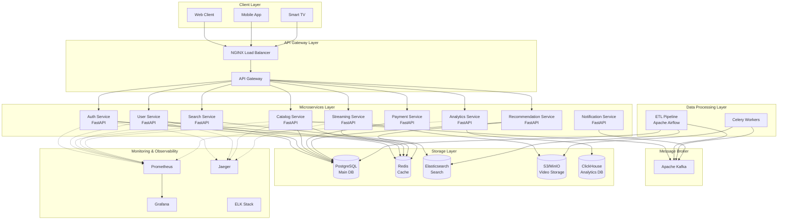
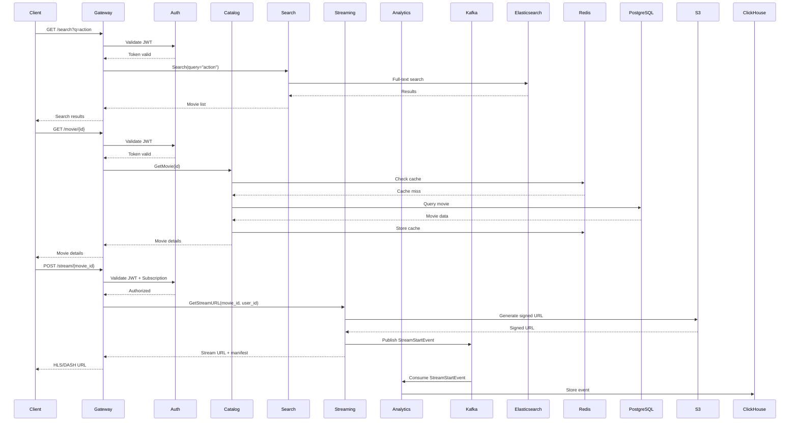
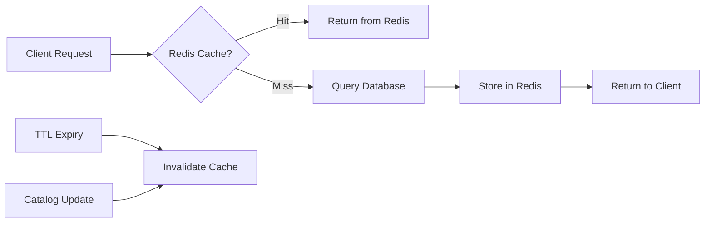

# Архитектура онлайн-кинотеатра

## 1. Диаграмма общей архитектуры



## 2. Список микросервисов и их ответственность

### 2.1 Auth Service (Сервис аутентификации)
**Ответственность:**
- Регистрация и аутентификация пользователей
- Выдача и валидация JWT токенов
- OAuth2 интеграция (Google, Facebook)
- Управление сессиями через Redis
- Rate limiting для защиты от bruteforce

**Технологии:**
- FastAPI + Pydantic
- PostgreSQL (пользовательские данные)
- Redis (сессии, refresh tokens)
- JWT (access/refresh tokens)
- Bcrypt (хеширование паролей)

### 2.2 User Service (Сервис пользователей)
**Ответственность:**
- Управление профилями пользователей
- Подписки и тарифные планы
- История просмотров
- Избранное и плейлисты
- Настройки и предпочтения

**Технологии:**
- FastAPI
- PostgreSQL
- Redis (кеширование профилей)

### 2.3 Catalog Service (Каталог контента)
**Ответственность:**
- Управление метаданными фильмов/сериалов
- Жанры, актеры, режиссеры
- Рейтинги и отзывы
- CRUD операции для контента
- Публикация событий в Kafka при изменениях

**Технологии:**
- FastAPI
- PostgreSQL (основные данные)
- Redis (кеширование популярного контента)
- Kafka (события изменения каталога)

### 2.4 Search Service (Поиск)
**Ответственность:**
- Полнотекстовый поиск по фильмам
- Фасетный поиск (фильтры по жанрам, годам, актерам)
- Автодополнение (autocomplete)
- Ранжирование результатов
- Поисковые подсказки

**Технологии:**
- FastAPI
- Elasticsearch (поисковый индекс)
- Redis (кеширование популярных запросов)

### 2.5 Streaming Service (Стриминг видео)
**Ответственность:**
- Генерация signed URLs для видео
- Адаптивный битрейт (HLS/DASH)
- Контроль доступа к контенту
- CDN integration
- DRM поддержка (опционально)
- Трекинг прогресса просмотра

**Технологии:**
- FastAPI
- S3/MinIO (хранение видео)
- Redis (кеш прогресса просмотра)
- FFmpeg (транскодинг)
- CloudFront/CDN

### 2.6 Analytics Service (Аналитика)
**Ответственность:**
- Сбор событий просмотра
- Метрики популярности контента
- Время просмотра и вовлеченность
- Дашборды для бизнеса
- A/B тестирование

**Технологии:**
- FastAPI
- ClickHouse (OLAP хранилище)
- Kafka (сбор событий)
- Redis (real-time счетчики)

### 2.7 Recommendation Service (Рекомендации)
**Ответственность:**
- Персонализированные рекомендации
- Collaborative filtering
- Content-based рекомендации
- Trending контент
- ML модели для предсказаний

**Технологии:**
- FastAPI
- PostgreSQL (данные для моделей)
- Redis (кеш рекомендаций)
- Scikit-learn/TensorFlow (ML)

### 2.8 Payment Service (Платежи)
**Ответственность:**
- Интеграция с платежными системами
- Управление подписками
- Обработка платежей
- Инвойсы и чеки
- Webhook обработка от платежных провайдеров

**Технологии:**
- FastAPI
- PostgreSQL
- Stripe/PayPal SDK
- Redis (idempotency keys)

### 2.9 Notification Service (Уведомления)
**Ответственность:**
- Email уведомления
- Push уведомления
- SMS (опционально)
- Уведомления о новом контенте
- Напоминания

**Технологии:**
- FastAPI
- Kafka Consumer
- SendGrid/AWS SES (email)
- Firebase Cloud Messaging (push)

### 2.10 ETL Pipeline (ETL процесс)
**Ответственность:**
- Загрузка метаданных из внешних источников (TMDb, IMDB)
- Синхронизация данных между PostgreSQL и Elasticsearch
- Обработка и нормализация данных
- Scheduled tasks для обновлений
- Транскодинг видео

**Технологии:**
- Apache Airflow (оркестрация)
- Celery (задачи на фоне)
- Kafka (event streaming)
- FFmpeg (транскодинг)

## 3. Схема взаимодействия сервисов



## 4. Структура проекта

```
online-cinema/
├── services/
│   ├── auth-service/
│   │   ├── app/
│   │   │   ├── api/
│   │   │   │   ├── v1/
│   │   │   │   │   ├── endpoints/
│   │   │   │   │   │   ├── __init__.py
│   │   │   │   │   │   ├── auth.py
│   │   │   │   │   │   └── oauth.py
│   │   │   │   │   └── router.py
│   │   │   │   └── deps.py
│   │   │   ├── core/
│   │   │   │   ├── config.py
│   │   │   │   ├── security.py
│   │   │   │   └── middleware.py
│   │   │   ├── db/
│   │   │   │   ├── models.py
│   │   │   │   ├── repositories.py
│   │   │   │   └── session.py
│   │   │   ├── schemas/
│   │   │   │   ├── auth.py
│   │   │   │   └── token.py
│   │   │   ├── services/
│   │   │   │   ├── auth_service.py
│   │   │   │   ├── jwt_service.py
│   │   │   │   └── redis_service.py
│   │   │   ├── utils/
│   │   │   │   ├── tracing.py
│   │   │   │   └── metrics.py
│   │   │   └── main.py
│   │   ├── tests/
│   │   ├── Dockerfile
│   │   ├── requirements.txt
│   │   └── pyproject.toml
│   │
│   ├── user-service/
│   │   └── [similar structure]
│   │
│   ├── catalog-service/
│   │   └── [similar structure]
│   │
│   ├── search-service/
│   │   └── [similar structure]
│   │
│   ├── streaming-service/
│   │   └── [similar structure]
│   │
│   ├── analytics-service/
│   │   └── [similar structure]
│   │
│   ├── recommendation-service/
│   │   └── [similar structure]
│   │
│   ├── payment-service/
│   │   └── [similar structure]
│   │
│   └── notification-service/
│       └── [similar structure]
│
├── etl/
│   ├── airflow/
│   │   ├── dags/
│   │   │   ├── sync_catalog_to_elasticsearch.py
│   │   │   ├── fetch_external_metadata.py
│   │   │   └── video_transcoding.py
│   │   ├── plugins/
│   │   └── config/
│   ├── celery-workers/
│   │   ├── tasks/
│   │   │   ├── transcoding.py
│   │   │   ├── thumbnails.py
│   │   │   └── indexing.py
│   │   ├── celeryconfig.py
│   │   └── worker.py
│   └── Dockerfile
│
├── api-gateway/
│   ├── nginx/
│   │   ├── nginx.conf
│   │   └── conf.d/
│   └── kong/
│       └── kong.yml
│
├── infrastructure/
│   ├── docker/
│   │   ├── docker-compose.yml
│   │   ├── docker-compose.dev.yml
│   │   └── docker-compose.prod.yml
│   ├── k8s/
│   │   ├── deployments/
│   │   ├── services/
│   │   ├── ingress/
│   │   ├── configmaps/
│   │   └── secrets/
│   ├── terraform/
│   │   ├── aws/
│   │   └── gcp/
│   └── monitoring/
│       ├── prometheus/
│       │   ├── prometheus.yml
│       │   └── alerts.yml
│       ├── grafana/
│       │   └── dashboards/
│       ├── jaeger/
│       │   └── jaeger-config.yml
│       └── elk/
│           ├── elasticsearch.yml
│           ├── logstash.conf
│           └── kibana.yml
│
├── shared/
│   ├── python-common/
│   │   ├── middleware/
│   │   │   ├── correlation_id.py
│   │   │   ├── error_handler.py
│   │   │   └── rate_limiter.py
│   │   ├── utils/
│   │   │   ├── logger.py
│   │   │   ├── metrics.py
│   │   │   └── tracer.py
│   │   └── setup.py
│   └── proto/
│       └── [Protocol Buffers если нужно gRPC]
│
├── docs/
│   ├── api/
│   │   └── openapi.yaml
│   ├── architecture/
│   │   ├── diagrams/
│   │   └── decisions/
│   └── runbooks/
│
├── scripts/
│   ├── init-db.sh
│   ├── migrate.sh
│   └── seed-data.py
│
├── .github/
│   └── workflows/
│       ├── ci.yml
│       └── cd.yml
│
├── README.md
├── ARCHITECTURE.md
└── docker-compose.yml
```

## 5. Выбор технологий с обоснованием

### 5.1 Backend Framework: FastAPI
**Обоснование:**
- Высокая производительность (comparable с Go/Node.js)
- Асинхронная обработка запросов (async/await)
- Автоматическая генерация OpenAPI документации
- Type hints и Pydantic для валидации
- Встроенная поддержка зависимостей (DI)

### 5.2 API Gateway: NGINX + Kong/Traefik
**Обоснование:**
- NGINX - проверенное решение для load balancing
- Kong - rich feature set (rate limiting, auth, logging)
- Service discovery
- Circuit breaker pattern
- Request/Response трансформация

### 5.3 Message Broker: Apache Kafka
**Обоснование:**
- Высокая пропускная способность (millions events/sec)
- Event sourcing и CQRS patterns
- Долгосрочное хранение событий
- Partitioning для масштабирования
- Exactly-once semantics

**Альтернатива:** RabbitMQ для простых use cases, но Kafka лучше для аналитики

### 5.4 Primary Database: PostgreSQL
**Обоснование:**
- ACID транзакции
- JSON/JSONB поддержка
- Full-text search (базовый)
- Репликация и шардирование
- Богатая экосистема (pgBouncer, TimescaleDB)

### 5.5 Cache: Redis
**Обоснование:**
- In-memory скорость
- Множество структур данных (strings, hashes, lists, sets)
- Pub/Sub для real-time
- Встроенная persistence (RDB + AOF)
- Cluster mode для HA

### 5.6 Search Engine: Elasticsearch
**Обоснование:**
- Мощный full-text search
- Фасетный поиск и aggregations
- Масштабирование через sharding
- Near real-time индексация
- RESTful API

### 5.7 Analytics DB: ClickHouse
**Обоснование:**
- Колоночное хранилище (OLAP)
- Высокая скорость аналитических запросов
- Compression (экономия места)
- Поддержка SQL
- Real-time data ingestion

### 5.8 Object Storage: S3/MinIO
**Обоснование:**
- Безлимитное масштабирование
- Высокая доступность
- CDN интеграция
- Versioning и lifecycle policies
- MinIO - S3-compatible self-hosted alternative

### 5.9 ETL Orchestration: Apache Airflow
**Обоснование:**
- DAG-based workflow
- Rich scheduling
- Monitoring и alerting
- Python-based (код как конфигурация)
- Большая экосистема операторов

### 5.10 Background Tasks: Celery
**Обоснование:**
- Асинхронное выполнение задач
- Распределенная обработка
- Retry logic
- Task routing
- Интеграция с Kafka/Redis

### 5.11 Monitoring: Prometheus + Grafana
**Обоснование:**
- Time-series метрики
- PromQL для запросов
- Service discovery
- Alertmanager
- Grafana - красивые дашборды

### 5.12 Distributed Tracing: Jaeger
**Обоснование:**
- OpenTelemetry compatible
- Визуализация request flow
- Performance profiling
- Root cause analysis
- Low overhead

### 5.13 Logging: ELK Stack (Elasticsearch, Logstash, Kibana)
**Обоснование:**
- Централизованное логирование
- Мощный поиск по логам
- Visualization
- Structured logging (JSON)

## 6. Стратегия масштабирования

### 6.1 Horizontal Scaling (Горизонтальное)

#### Microservices
```yaml
# Kubernetes HPA Example
apiVersion: autoscaling/v2
kind: HorizontalPodAutoscaler
metadata:
  name: catalog-service-hpa
spec:
  scaleTargetRef:
    apiVersion: apps/v1
    kind: Deployment
    name: catalog-service
  minReplicas: 3
  maxReplicas: 20
  metrics:
  - type: Resource
    resource:
      name: cpu
      target:
        type: Utilization
        averageUtilization: 70
  - type: Resource
    resource:
      name: memory
      target:
        type: Utilization
        averageUtilization: 80
```

**Стратегии:**
- Auto-scaling на основе CPU/Memory/RPS
- Load balancing через NGINX/ALB
- Service mesh (Istio/Linkerd) для сложных сценариев
- Stateless сервисы (состояние в Redis/DB)

#### Database Scaling

**PostgreSQL:**
- Read replicas для read-heavy операций
- Connection pooling (PgBouncer)
- Partitioning по датам/регионам
- Sharding по user_id для User Service

**Redis:**
- Redis Cluster (automatic sharding)
- Read replicas
- Sentinel для HA

**Elasticsearch:**
- Index sharding (default)
- Replica shards для read scaling
- Hot/Warm/Cold architecture

### 6.2 Vertical Scaling (Вертикальное)

**Когда применять:**
- PostgreSQL master (до определенного предела)
- Redis (single-threaded, benefit from faster CPU)
- ClickHouse (compression + columnar = CPU intensive)

### 6.3 Caching Strategy



**Multi-level caching:**
1. **CDN Level** - Static assets, video chunks (CloudFront/Cloudflare)
2. **API Gateway Level** - Rate limiting, common responses
3. **Application Level** - Redis (hot data, sessions)
4. **Database Level** - Query cache, materialized views

**Cache invalidation:**
- Event-driven (Kafka events → invalidate specific keys)
- TTL-based для read-heavy, редко меняющихся данных
- Write-through для критичных данных

### 6.4 Database Optimization

**Indexing Strategy:**
```sql
-- Catalog Service
CREATE INDEX idx_movies_genre ON movies(genre);
CREATE INDEX idx_movies_release_year ON movies(release_year);
CREATE INDEX idx_movies_rating ON movies(rating DESC);

-- Composite index для частых запросов
CREATE INDEX idx_movies_genre_year ON movies(genre, release_year);

-- Partial index
CREATE INDEX idx_active_subscriptions
ON subscriptions(user_id)
WHERE status = 'active';
```

**Partitioning:**
```sql
-- Партиционирование аналитики по датам
CREATE TABLE viewing_events (
    id BIGSERIAL,
    user_id BIGINT,
    movie_id BIGINT,
    event_time TIMESTAMP,
    ...
) PARTITION BY RANGE (event_time);

CREATE TABLE viewing_events_2024_01
PARTITION OF viewing_events
FOR VALUES FROM ('2024-01-01') TO ('2024-02-01');
```

### 6.5 Async Processing

**Pattern: Event-Driven Architecture**

```python
# Catalog Service - Publish event
async def update_movie(movie_id: int, data: MovieUpdate):
    # Update DB
    movie = await movie_repo.update(movie_id, data)

    # Publish event to Kafka
    await kafka_producer.send(
        topic='catalog.movie.updated',
        value={
            'movie_id': movie_id,
            'action': 'updated',
            'timestamp': datetime.utcnow()
        }
    )
    return movie

# Search Service - Consume event
async def handle_catalog_event(event):
    if event['action'] == 'updated':
        movie = await catalog_api.get_movie(event['movie_id'])
        await elasticsearch.update_document(
            index='movies',
            id=event['movie_id'],
            body=movie
        )
```

### 6.6 Rate Limiting & Throttling

```python
from slowapi import Limiter, _rate_limit_exceeded_handler
from slowapi.util import get_remote_address

limiter = Limiter(key_func=get_remote_address)

@app.get("/search")
@limiter.limit("100/minute")  # Per IP
async def search(query: str):
    ...

# Premium users
@limiter.limit("1000/minute")
async def search_premium(query: str):
    ...
```

### 6.7 CDN Strategy

**Video Delivery:**
```
User Request → CDN (CloudFront/Cloudflare)
    ↓ (Cache Miss)
Origin (S3/MinIO) → Transcode on-the-fly if needed
    ↓
CDN Cache → Serve to user
```

**Benefits:**
- Reduced latency (edge locations)
- Reduced origin load
- HTTPS/TLS termination at edge
- DDoS protection

### 6.8 Circuit Breaker Pattern

```python
from circuitbreaker import circuit

@circuit(failure_threshold=5, recovery_timeout=60)
async def call_payment_service(payment_data):
    async with httpx.AsyncClient() as client:
        response = await client.post(
            "http://payment-service/api/v1/charge",
            json=payment_data
        )
        return response.json()

# Fallback при открытом circuit
async def process_payment(payment_data):
    try:
        result = await call_payment_service(payment_data)
    except CircuitBreakerError:
        # Fallback: queue payment for later processing
        await payment_queue.enqueue(payment_data)
        return {"status": "queued"}
```

### 6.9 Capacity Planning

**Примерные расчеты для 1M active users:**

```
Requests:
- Peak: 10,000 RPS (search + catalog)
- Streaming: 100,000 concurrent streams

Services instances:
- Auth: 5-10 pods (1000 RPS each)
- Catalog: 10-20 pods
- Search: 10-15 pods
- Streaming: 50-100 pods (most traffic)

Database:
- PostgreSQL: Master + 3-5 read replicas
- Redis: 3-node cluster (10GB each)
- Elasticsearch: 6-node cluster (3 masters, 3 data)

Storage:
- 100,000 movies × 5GB avg = 500TB
- +30% for multiple qualities = 650TB
```

### 6.10 Disaster Recovery

**Backup Strategy:**
- PostgreSQL: Daily full backup + WAL archiving (PITR)
- Redis: RDB snapshots every 1h + AOF
- S3: Cross-region replication
- Elasticsearch: Snapshot to S3 daily

**HA Setup:**
- Multi-AZ deployment
- Active-passive для databases
- Active-active для stateless services
- Auto-failover (Kubernetes liveness probes)

## 7. Security Considerations

### 7.1 Authentication & Authorization
- JWT tokens (access: 15min, refresh: 7days)
- OAuth2 + OpenID Connect
- Role-based access control (RBAC)
- API key для service-to-service

### 7.2 Data Protection
- Encryption at rest (AES-256)
- Encryption in transit (TLS 1.3)
- Sensitive data в environment variables/secrets
- PII tokenization

### 7.3 API Security
- Rate limiting
- Input validation (Pydantic)
- CORS configuration
- SQL injection prevention (ORM)
- XSS protection (content type headers)

### 7.4 DRM (Digital Rights Management)
- Widevine/FairPlay для premium контента
- Signed URLs с expiration
- IP whitelisting для admin endpoints
- Watermarking для tracking piracy

## 8. Monitoring Metrics (KPIs)

### Service Health
- Request rate (RPS)
- Error rate (4xx, 5xx)
- Latency (p50, p95, p99)
- Saturation (CPU, Memory, Disk I/O)

### Business Metrics
- Concurrent viewers
- Video start time (QoS)
- Buffering ratio
- Conversion rate (free → paid)
- Churn rate

### Database
- Query execution time
- Connection pool usage
- Cache hit rate
- Replication lag

## 9. Deployment Strategy

### CI/CD Pipeline
```yaml
# .github/workflows/deploy.yml
name: Deploy Service
on:
  push:
    branches: [main]

jobs:
  test:
    runs-on: ubuntu-latest
    steps:
      - uses: actions/checkout@v3
      - name: Run tests
        run: pytest tests/

  build:
    needs: test
    steps:
      - name: Build Docker image
        run: docker build -t service:${{ github.sha }}

  deploy:
    needs: build
    steps:
      - name: Deploy to K8s
        run: kubectl apply -f k8s/
      - name: Rolling update
        run: kubectl set image deployment/service service=service:${{ github.sha }}
```

### Blue-Green Deployment
- Zero-downtime deployments
- Instant rollback capability
- Traffic shifting (10% → 50% → 100%)

---

## Итого

Эта архитектура обеспечивает:
- **Масштабируемость**: Horizontal scaling всех компонентов
- **Отказоустойчивость**: Multi-AZ, replication, circuit breakers
- **Производительность**: Caching, CDN, async processing
- **Observability**: Metrics, logs, traces
- **Безопасность**: Auth, encryption, rate limiting
- **Развертывание**: CI/CD, containerization, IaC

Готово к обработке миллионов пользователей и петабайтов контента.
